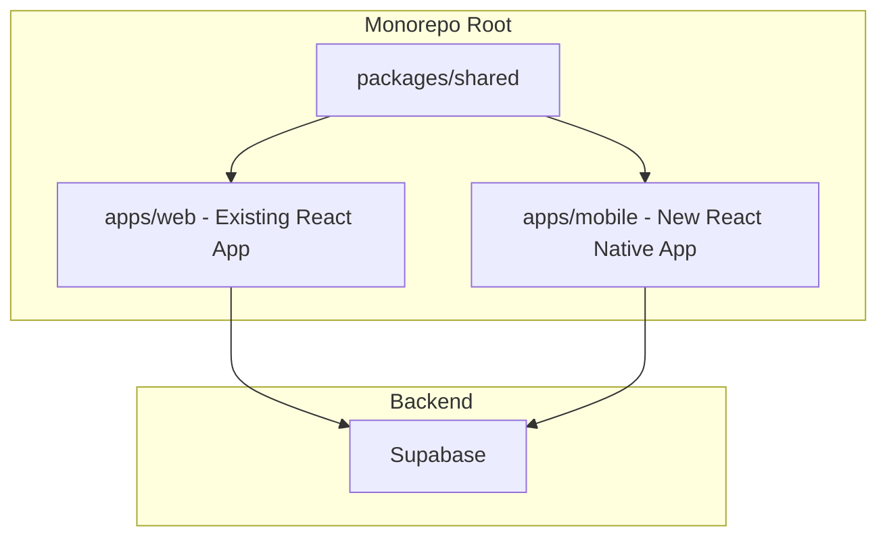

# React Native iOS App for ProfitPath

## Architecture Overview

Create a **monorepo structure** that extracts shared business logic into a common package, allowing both the web app and the new React Native iOS app to consume the same code.




## Recommended Tech Stack


| Layer      | Technology                   | Rationale                                          |
| ---------- | ---------------------------- | -------------------------------------------------- |
| Framework  | **Expo** (managed workflow)  | Faster development, easier iOS builds, OTA updates |
| Navigation | React Navigation             | Industry standard for RN                           |
| Storage    | AsyncStorage                 | localStorage replacement                           |
| Styling    | NativeWind (Tailwind for RN) | Reuse Tailwind knowledge from web                  |
| Charts     | react-native-gifted-charts   | Similar API to Recharts                            |
| State      | Context + Reducers           | Same pattern as web app                            |


## Project Structure

```
/Users/jcware/code/projects/ProfitPath/
├── packages/
│   └── shared/                    # NEW: Shared business logic
│       ├── package.json
│       ├── src/
│       │   ├── hooks/             # Platform-agnostic hooks
│       │   ├── reducers/          # All reducers (as-is)
│       │   ├── utils/             # calculations.js (as-is)
│       │   ├── types/             # TypeScript types (optional)
│       │   └── supabase/          # Supabase client factory
│       └── index.js
├── apps/
│   ├── web/                       # MOVED: Current /app folder
│   │   └── (existing web app)
│   └── mobile/                    # NEW: React Native iOS app
│       ├── app.json
│       ├── App.tsx
│       ├── src/
│       │   ├── components/        # RN UI components
│       │   ├── screens/           # Screen components
│       │   ├── navigation/        # React Navigation setup
│       │   ├── context/           # Adapted context providers
│       │   └── adapters/          # Storage adapters
│       └── package.json
└── package.json                   # Monorepo root (npm workspaces)
```

## Shared Code Strategy

### Directly Reusable (copy to `packages/shared`)


| File                  | Path                                  | Notes                                  |
| --------------------- | ------------------------------------- | -------------------------------------- |
| calculations.js       | `app/src/utils/calculations.js`       | All pure functions - copy as-is        |
| accountsReducer.js    | `app/src/reducers/accountsReducer.js` | Pure reducer - copy as-is              |
| tradeReducer.js       | `app/src/reducers/tradeReducer.js`    | Pure reducer - copy as-is              |
| usersReducer.js       | `app/src/reducers/usersReducer.js`    | Pure reducer - copy as-is              |
| useFilteredTrades.js  | `app/src/hooks/useFilteredTrades.js`  | Pure filtering logic - copy as-is      |

### Needs Import Path Updates (Supabase dependency)

These hooks import from `../supabaseClient` which will break when moved. They must be refactored to use dependency injection:

| File                  | Current Import                          | Required Change                        |
| --------------------- | --------------------------------------- | -------------------------------------- |
| useAuth.js            | `import { supabase } from '../supabaseClient'` | Accept `supabase` as parameter or use context |
| useTradeManagement.js | `import { supabase } from '../supabaseClient'` | Accept `supabase` as parameter or use context |
| useTagManagement.js   | Uses TagContext which uses supabaseClient      | Refactor TagContext for DI             |

**Solution: Supabase Client Factory Pattern**

Create a shared Supabase context that each app initializes with its own credentials:

```javascript
// packages/shared/src/supabase/SupabaseContext.js
import { createContext, useContext } from 'react';

const SupabaseContext = createContext(null);

export const SupabaseProvider = ({ client, children }) => (
  <SupabaseContext.Provider value={client}>
    {children}
  </SupabaseContext.Provider>
);

export const useSupabase = () => {
  const client = useContext(SupabaseContext);
  if (!client) {
    throw new Error('useSupabase must be used within a SupabaseProvider');
  }
  return client;
};
```

Then update shared hooks to use `useSupabase()` instead of direct imports:

```javascript
// packages/shared/src/hooks/useAuth.js (refactored)
import { useSupabase } from '../supabase/SupabaseContext';

export const useAuth = () => {
  const supabase = useSupabase(); // Instead of: import { supabase } from '../supabaseClient'
  // ... rest of hook unchanged
};
```

Each app initializes its own client:

```javascript
// apps/web/src/App.jsx
import { createClient } from '@supabase/supabase-js';
import { SupabaseProvider } from '@profitpath/shared';

const supabase = createClient(
  process.env.REACT_APP_SUPABASE_URL,
  process.env.REACT_APP_SUPABASE_ANON_KEY
);

function App() {
  return (
    <SupabaseProvider client={supabase}>
      {/* app content */}
    </SupabaseProvider>
  );
}
```

```javascript
// apps/mobile/App.tsx
import { createClient } from '@supabase/supabase-js';
import { SupabaseProvider } from '@profitpath/shared';
import Constants from 'expo-constants';

const supabase = createClient(
  Constants.expoConfig.extra.supabaseUrl,
  Constants.expoConfig.extra.supabaseAnonKey
);

function App() {
  return (
    <SupabaseProvider client={supabase}>
      {/* app content */}
    </SupabaseProvider>
  );
}
```

### Needs Adaptation (platform-specific layer)


| File                  | Web Dependency              | React Native Replacement          |
| --------------------- | --------------------------- | --------------------------------- |
| useAppState.js        | `localStorage`              | `AsyncStorage`                    |
| DateFilterContext.jsx | `localStorage`, URL params  | `AsyncStorage`, navigation state  |
| TagFilterContext.jsx  | `localStorage`, URL params  | `AsyncStorage`, navigation state  |
| ThemeContext.jsx      | `localStorage`, DOM classes | `AsyncStorage`, RN Appearance API |

**Critical: Sync vs Async Storage**

`localStorage` is **synchronous** but `AsyncStorage` is **asynchronous**. The web contexts use patterns like:

```javascript
// Web (synchronous) - works immediately
const storedValue = window.localStorage.getItem(STORAGE_KEY);
const parsed = JSON.parse(storedValue);
```

This cannot be directly replaced with AsyncStorage:

```javascript
// BROKEN - getItem returns Promise, not string
const storedValue = storage.getItem(STORAGE_KEY); // Promise!
const parsed = JSON.parse(storedValue); // Fails - can't parse a Promise
```

**Solution: Async-aware Context Initialization**

Context providers for React Native must handle async initialization with loading states:

```javascript
// apps/mobile/src/context/DateFilterContext.jsx
import { useState, useEffect } from 'react';
import AsyncStorage from '@react-native-async-storage/async-storage';

export const DateFilterProvider = ({ children }) => {
  const [filter, setFilter] = useState(null);
  const [isLoading, setIsLoading] = useState(true);

  // Async initialization
  useEffect(() => {
    const loadPersistedFilter = async () => {
      try {
        const stored = await AsyncStorage.getItem(STORAGE_KEY);
        if (stored) {
          const parsed = JSON.parse(stored);
          setFilter(buildFilter(parsed));
        } else {
          setFilter(getDefaultFilter());
        }
      } catch (error) {
        setFilter(getDefaultFilter());
      } finally {
        setIsLoading(false);
      }
    };
    loadPersistedFilter();
  }, []);

  // Async persistence (fire-and-forget)
  useEffect(() => {
    if (!isLoading && filter) {
      AsyncStorage.setItem(STORAGE_KEY, JSON.stringify(filter)).catch(() => {});
    }
  }, [filter, isLoading]);

  if (isLoading) {
    return null; // Or a loading spinner
  }

  return (
    <DateFilterContext.Provider value={/* ... */}>
      {children}
    </DateFilterContext.Provider>
  );
};
```

This pattern:
1. Shows loading state until storage is read
2. Uses `useEffect` for async initialization
3. Persists changes with fire-and-forget async writes

### Cannot Share (platform-specific UI)

- All components in `app/src/components/` (React DOM vs React Native)
- Recharts charts → rebuild with react-native-gifted-charts
- Tailwind styles → adapt with NativeWind

## Implementation Steps

### Phase 1: Monorepo Setup (on feature branch)

1. Create feature branch: `git checkout -b monorepo-restructure`
2. Create directory structure: `apps/`, `packages/shared/`
3. Move existing `app/` to `apps/web/`
4. Configure npm workspaces in root package.json
5. Create `vercel.json` with monorepo settings
6. Create `packages/shared/src/supabase/SupabaseContext.js` (client factory)
7. Extract shared code to `packages/shared/`:
   - Copy `calculations.js`, all reducers, `useFilteredTrades.js` as-is
   - Refactor `useAuth.js`, `useTradeManagement.js` to use `useSupabase()` instead of direct imports
8. Update web app:
   - Wrap app in `<SupabaseProvider client={supabase}>`
   - Update imports to use `@profitpath/shared`
9. Test locally: `npm install && npm run build:web`
10. Push branch and verify Vercel preview deployment
11. Merge to main only after preview works

### Phase 2: React Native Project

1. Create Expo project in `apps/mobile/`
2. Install dependencies: `@supabase/supabase-js`, `date-fns`, `@react-native-async-storage/async-storage`, `react-navigation`, `nativewind`
3. Create async storage utilities (`apps/mobile/src/utils/storage.js`)
4. Create mobile-specific context providers with async initialization:
   - `DateFilterContext` - async load from storage, loading state
   - `TagFilterContext` - async load from storage, loading state  
   - `ThemeContext` - use RN Appearance API + async persistence
5. Initialize Supabase client and wrap app in `<SupabaseProvider>`

### Phase 3: Core Features

1. Build navigation structure (Tab Navigator with Dashboard, Trade History, Add Trade)
2. Create screen components that mirror web views
3. Build UI components (cards, forms, tables as lists)
4. Integrate shared hooks and business logic

### Phase 4: Charts and Polish

1. Implement charts using react-native-gifted-charts
2. Add iOS-specific UX (haptic feedback, native date pickers)
3. Configure Expo EAS Build for iOS distribution

## Key Files to Create

### Root package.json (monorepo config)

```json
{
  "name": "profitpath",
  "private": true,
  "workspaces": ["packages/*", "apps/*"]
}
```

### packages/shared/package.json

```json
{
  "name": "@profitpath/shared",
  "version": "1.0.0",
  "main": "src/index.js",
  "dependencies": {
    "@supabase/supabase-js": "^2.56.1",
    "date-fns": "^4.1.0"
  }
}
```

### Storage Utilities for React Native

Since `AsyncStorage` is async and `localStorage` is sync, do NOT create a drop-in adapter. Instead, use async utilities:

```javascript
// apps/mobile/src/utils/storage.js
import AsyncStorage from '@react-native-async-storage/async-storage';

export const storage = {
  // All methods return Promises - callers must await
  getItem: async (key) => {
    try {
      return await AsyncStorage.getItem(key);
    } catch (error) {
      console.error('Storage read error:', error);
      return null;
    }
  },
  
  setItem: async (key, value) => {
    try {
      await AsyncStorage.setItem(key, value);
    } catch (error) {
      console.error('Storage write error:', error);
    }
  },
  
  removeItem: async (key) => {
    try {
      await AsyncStorage.removeItem(key);
    } catch (error) {
      console.error('Storage remove error:', error);
    }
  },
};

// Helper for JSON data
export const storageJson = {
  get: async (key) => {
    const value = await storage.getItem(key);
    return value ? JSON.parse(value) : null;
  },
  
  set: async (key, value) => {
    await storage.setItem(key, JSON.stringify(value));
  },
};
```

**Important:** Context providers must be redesigned for async initialization (see "Async-aware Context Initialization" above). You cannot simply replace `localStorage.getItem()` with `storage.getItem()` - the calling code must handle Promises.

## Dependencies for React Native App

```json
{
  "dependencies": {
    "@profitpath/shared": "*",
    "@react-native-async-storage/async-storage": "^1.21.0",
    "@react-navigation/native": "^6.1.0",
    "@react-navigation/bottom-tabs": "^6.5.0",
    "@supabase/supabase-js": "^2.56.1",
    "date-fns": "^4.1.0",
    "expo": "~50.0.0",
    "nativewind": "^2.0.11",
    "react-native-gifted-charts": "^1.4.0"
  }
}
```

## Vercel Deployment Strategy

Moving to a monorepo requires updating Vercel to find the web app in its new location. Follow these steps in order:

### Step 1: Create vercel.json (before moving files)

Create `vercel.json` in the **repository root**:

```json
{
  "buildCommand": "cd apps/web && npm run build",
  "outputDirectory": "apps/web/build",
  "installCommand": "npm install",
  "framework": "create-react-app"
}
```

### Step 2: Update Vercel Dashboard Settings

Before deploying the restructured code:

1. Go to your Vercel project dashboard
2. Navigate to **Settings** > **General**
3. Update **Root Directory** to: `apps/web`
4. Navigate to **Settings** > **Environment Variables**
5. Verify `REACT_APP_SUPABASE_URL` and `REACT_APP_SUPABASE_ANON_KEY` are set

### Step 3: Safe Migration Order

Execute in this exact order to avoid broken deployments:

1. **Create a feature branch** - do all work here first
2. **Set up monorepo structure** - create directories, move files
3. **Test locally** - run `npm install` at root, then `npm run build` in apps/web
4. **Push feature branch** - Vercel will create a preview deployment
5. **Verify preview deployment works** - check the preview URL
6. **Merge to main** - only after preview is confirmed working

### Step 4: Monorepo-aware vercel.json (final version)

After restructuring, use this enhanced configuration:

```json
{
  "buildCommand": "npm run build --workspace=apps/web",
  "outputDirectory": "apps/web/build",
  "installCommand": "npm install",
  "framework": "create-react-app",
  "ignoreCommand": "git rev-parse --verify HEAD^ >/dev/null 2>&1 && git diff --quiet HEAD^ HEAD -- apps/web packages/shared"
}
```

The `ignoreCommand` prevents unnecessary rebuilds when only mobile app changes are pushed.

**How it works:**
1. `git rev-parse --verify HEAD^` checks if a parent commit exists
2. If no parent exists (first deployment, shallow clone), the command fails and exits non-zero → Vercel proceeds with build
3. If parent exists, `git diff --quiet` runs:
   - Exit 0 (no changes in apps/web or packages/shared) → Vercel skips build
   - Exit 1 (changes detected) → Vercel proceeds with build

### Environment Variables for Monorepo

Root `package.json` should include workspace-aware scripts:

```json
{
  "scripts": {
    "build:web": "npm run build --workspace=apps/web",
    "start:web": "npm run start --workspace=apps/web",
    "build:mobile": "cd apps/mobile && npx expo export"
  }
}
```

### Rollback Plan

If deployment fails after merge:
1. Vercel keeps previous deployments - use **Deployments** tab to instantly rollback
2. Or revert the git commit and push to trigger a rebuild

## Risks and Mitigations


| Risk                       | Mitigation                                                                      |
| -------------------------- | ------------------------------------------------------------------------------- |
| Monorepo complexity        | Start simple with npm workspaces; consider Turborepo later if needed            |
| Chart library differences  | Prioritize functionality over visual parity; charts may look slightly different |
| iOS build complexity       | Use Expo EAS Build to handle signing and provisioning                           |
| Vercel deployment break    | Use feature branch + preview deployment; verify before merging to main          |
| Broken Supabase imports    | Use SupabaseContext for dependency injection; refactor hooks before moving      |
| Sync/async storage mismatch| Redesign context providers for async initialization; never use drop-in adapter |


