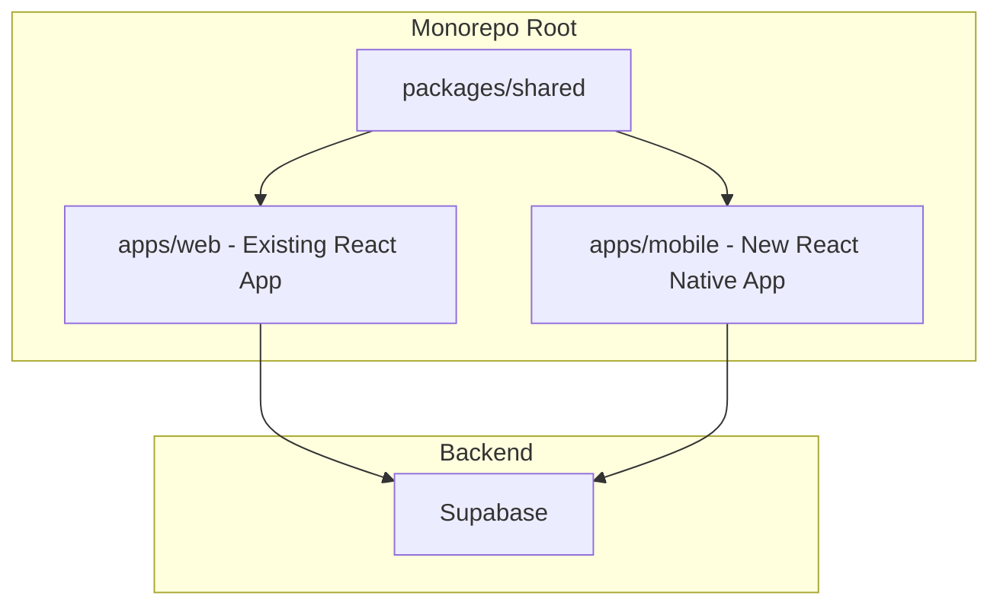

# React Native iOS App for ProfitPath

## Architecture Overview

Create a **monorepo structure** that extracts shared business logic into a common package, allowing both the web app and the new React Native iOS app to consume the same code.




## Recommended Tech Stack


| Layer      | Technology                   | Rationale                                          |
| ---------- | ---------------------------- | -------------------------------------------------- |
| Framework  | **Expo** (managed workflow)  | Faster development, easier iOS builds, OTA updates |
| Navigation | React Navigation             | Industry standard for RN                           |
| Storage    | AsyncStorage                 | localStorage replacement                           |
| Styling    | NativeWind (Tailwind for RN) | Reuse Tailwind knowledge from web                  |
| Charts     | react-native-gifted-charts   | Similar API to Recharts                            |
| State      | Context + Reducers           | Same pattern as web app                            |


## Project Structure

```
/Users/jcware/code/projects/ProfitPath/
├── packages/
│   └── shared/                    # NEW: Shared business logic
│       ├── package.json
│       ├── src/
│       │   ├── hooks/             # Platform-agnostic hooks
│       │   ├── reducers/          # All reducers (as-is)
│       │   ├── utils/             # calculations.js (as-is)
│       │   ├── types/             # TypeScript types (optional)
│       │   └── supabase/          # Supabase client factory
│       └── index.js
├── apps/
│   ├── web/                       # MOVED: Current /app folder
│   │   └── (existing web app)
│   └── mobile/                    # NEW: React Native iOS app
│       ├── app.json
│       ├── App.tsx
│       ├── src/
│       │   ├── components/        # RN UI components
│       │   ├── screens/           # Screen components
│       │   ├── navigation/        # React Navigation setup
│       │   ├── context/           # Adapted context providers
│       │   └── adapters/          # Storage adapters
│       └── package.json
└── package.json                   # Monorepo root (npm workspaces)
```

## Shared Code Strategy

### Directly Reusable (copy as-is to `packages/shared`)


| File                  | Path                                  | Notes                |
| --------------------- | ------------------------------------- | -------------------- |
| calculations.js       | `app/src/utils/calculations.js`       | All pure functions   |
| accountsReducer.js    | `app/src/reducers/accountsReducer.js` | Pure reducer         |
| tradeReducer.js       | `app/src/reducers/tradeReducer.js`    | Pure reducer         |
| usersReducer.js       | `app/src/reducers/usersReducer.js`    | Pure reducer         |
| useAuth.js            | `app/src/hooks/useAuth.js`            | Uses Supabase only   |
| useTradeManagement.js | `app/src/hooks/useTradeManagement.js` | Uses Supabase only   |
| useFilteredTrades.js  | `app/src/hooks/useFilteredTrades.js`  | Pure filtering logic |
| useTagManagement.js   | `app/src/hooks/useTagManagement.js`   | Wrapper hook         |


### Needs Adaptation (platform-specific layer)


| File                  | Web Dependency              | React Native Replacement          |
| --------------------- | --------------------------- | --------------------------------- |
| useAppState.js        | `localStorage`              | `AsyncStorage`                    |
| DateFilterContext.jsx | `localStorage`, URL params  | `AsyncStorage`, navigation state  |
| TagFilterContext.jsx  | `localStorage`, URL params  | `AsyncStorage`, navigation state  |
| ThemeContext.jsx      | `localStorage`, DOM classes | `AsyncStorage`, RN Appearance API |


### Cannot Share (platform-specific UI)

- All components in `app/src/components/` (React DOM vs React Native)
- Recharts charts → rebuild with react-native-gifted-charts
- Tailwind styles → adapt with NativeWind

## Implementation Steps

### Phase 1: Monorepo Setup (on feature branch)

1. Create feature branch: `git checkout -b monorepo-restructure`
2. Create directory structure: `apps/`, `packages/shared/`
3. Move existing `app/` to `apps/web/`
4. Configure npm workspaces in root package.json
5. Create `vercel.json` with monorepo settings
6. Extract shared code to `packages/shared/`
7. Update web app imports to use `@profitpath/shared`
8. Test locally: `npm install && npm run build:web`
9. Push branch and verify Vercel preview deployment
10. Merge to main only after preview works

### Phase 2: React Native Project

1. Create Expo project in `apps/mobile/`
2. Install dependencies: `@supabase/supabase-js`, `date-fns`, `@react-native-async-storage/async-storage`, `react-navigation`, `nativewind`
3. Create storage adapter that wraps AsyncStorage with same interface as localStorage
4. Port context providers with storage adapter

### Phase 3: Core Features

1. Build navigation structure (Tab Navigator with Dashboard, Trade History, Add Trade)
2. Create screen components that mirror web views
3. Build UI components (cards, forms, tables as lists)
4. Integrate shared hooks and business logic

### Phase 4: Charts and Polish

1. Implement charts using react-native-gifted-charts
2. Add iOS-specific UX (haptic feedback, native date pickers)
3. Configure Expo EAS Build for iOS distribution

## Key Files to Create

### Root package.json (monorepo config)

```json
{
  "name": "profitpath",
  "private": true,
  "workspaces": ["packages/*", "apps/*"]
}
```

### packages/shared/package.json

```json
{
  "name": "@profitpath/shared",
  "version": "1.0.0",
  "main": "src/index.js",
  "dependencies": {
    "@supabase/supabase-js": "^2.56.1",
    "date-fns": "^4.1.0"
  }
}
```

### Storage Adapter Pattern

```javascript
// apps/mobile/src/adapters/storage.js
import AsyncStorage from '@react-native-async-storage/async-storage';

export const storage = {
  getItem: (key) => AsyncStorage.getItem(key),
  setItem: (key, value) => AsyncStorage.setItem(key, value),
  removeItem: (key) => AsyncStorage.removeItem(key),
};
```

## Dependencies for React Native App

```json
{
  "dependencies": {
    "@profitpath/shared": "*",
    "@react-native-async-storage/async-storage": "^1.21.0",
    "@react-navigation/native": "^6.1.0",
    "@react-navigation/bottom-tabs": "^6.5.0",
    "@supabase/supabase-js": "^2.56.1",
    "date-fns": "^4.1.0",
    "expo": "~50.0.0",
    "nativewind": "^2.0.11",
    "react-native-gifted-charts": "^1.4.0"
  }
}
```

## Vercel Deployment Strategy

Moving to a monorepo requires updating Vercel to find the web app in its new location. Follow these steps in order:

### Step 1: Create vercel.json (before moving files)

Create `vercel.json` in the **repository root**:

```json
{
  "buildCommand": "cd apps/web && npm run build",
  "outputDirectory": "apps/web/build",
  "installCommand": "npm install",
  "framework": "create-react-app"
}
```

### Step 2: Update Vercel Dashboard Settings

Before deploying the restructured code:

1. Go to your Vercel project dashboard
2. Navigate to **Settings** > **General**
3. Update **Root Directory** to: `apps/web`
4. Navigate to **Settings** > **Environment Variables**
5. Verify `REACT_APP_SUPABASE_URL` and `REACT_APP_SUPABASE_ANON_KEY` are set

### Step 3: Safe Migration Order

Execute in this exact order to avoid broken deployments:

1. **Create a feature branch** - do all work here first
2. **Set up monorepo structure** - create directories, move files
3. **Test locally** - run `npm install` at root, then `npm run build` in apps/web
4. **Push feature branch** - Vercel will create a preview deployment
5. **Verify preview deployment works** - check the preview URL
6. **Merge to main** - only after preview is confirmed working

### Step 4: Monorepo-aware vercel.json (final version)

After restructuring, use this enhanced configuration:

```json
{
  "buildCommand": "npm run build --workspace=apps/web",
  "outputDirectory": "apps/web/build",
  "installCommand": "npm install",
  "framework": "create-react-app",
  "ignoreCommand": "git diff HEAD^ HEAD --quiet -- apps/web packages/shared"
}
```

The `ignoreCommand` prevents unnecessary rebuilds when only mobile app changes are pushed.

### Environment Variables for Monorepo

Root `package.json` should include workspace-aware scripts:

```json
{
  "scripts": {
    "build:web": "npm run build --workspace=apps/web",
    "start:web": "npm run start --workspace=apps/web",
    "build:mobile": "cd apps/mobile && npx expo export"
  }
}
```

### Rollback Plan

If deployment fails after merge:
1. Vercel keeps previous deployments - use **Deployments** tab to instantly rollback
2. Or revert the git commit and push to trigger a rebuild

## Risks and Mitigations


| Risk                      | Mitigation                                                                      |
| ------------------------- | ------------------------------------------------------------------------------- |
| Monorepo complexity       | Start simple with npm workspaces; consider Turborepo later if needed            |
| Chart library differences | Prioritize functionality over visual parity; charts may look slightly different |
| iOS build complexity      | Use Expo EAS Build to handle signing and provisioning                           |
| Vercel deployment break   | Use feature branch + preview deployment; verify before merging to main          |


